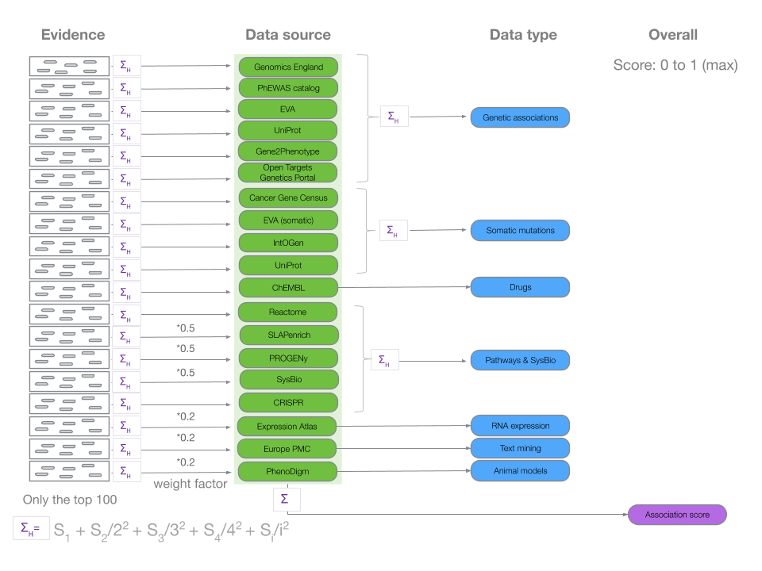

# Association score

The [Open Targets Platform](https://www.targetvalidation.org/) allows prioritisation of drug targets based on the strength of their association with a disease.

We allow for the prioritisation of targets by scoring target-disease associations based on evidence from 20 [data sources](https://docs.targetvalidation.org/data-sources/). Similar data sources \(e.g. Open Targets [Genetics portal](https://genetics.opentargets.org/) and PheWAS\) are grouped together into data types \(e.g. Genetic associations\). The score for the associations ranges from 0 to 1; the stronger the evidence for an association, the stronger the association score \(closer to 1\). A score of 0 corresponds to no evidence supporting an association. In the Open Targets Platform, we represent the different scores with varying shades of blue: the darker the blue, the stronger the association.

What are the factors that affect the confidence we have in the evidence used for our associations? We assess key factors such as frequency, severity and significance of the evidence to provide association scores to help you answer these questions:

* Which targets have the most evidence for being associated with a disease?
* What is the relative weight of the evidence for different targets associated with a disease?

Our scoring framework is a four-tier process: we first score the individual evidence, then we aggregate the evidence scores into data sources scores, followed by the aggregation of data source scores to give rise to the data types scores. Our overall association score is the result of the aggregation of all data source scores together.


`Pathways & systems biology` is the new name for what we used to call`Affected pathways`in the user interface of Open Targets Platform.


At each aggregation step, denoted by the `sum` symbol above, we apply the [harmonic progression](https://en.wikipedia.org/wiki/Harmonic_progression_%28mathematics%29) using the following formula as follows:

## Computing the Association Score 

We start by generating a score for each evidence from different data sources \(e.g. European Variation Archive\) within a data type \(e.g. Genetic associations\). We define the evidence score as:

`s = F * S * C`

where

s = score

F = frequency, the relative occurrence of a target-disease evidence

S = severity, the magnitude or strength of the effect described by the evidence

C = confidence, overall confidence for the observation that generates the target-disease evidence

The evidence score summarises the strength of the evidence and depends on factors that affect its relative strength. These factors are specific to the different data sources in the Platform:

| Data type | Data sources and factors that affect the relative strength of the evidence scores |
| :--- | :--- |
| Genetic associations | PheWASCatalog \(functional consequence score of [variants](https://www.targetvalidation.org/variants), normalised p-value and normalised sample size\); European Variation Archive \(functional consequence score of variants e.g. germline variants that cause transcript ablation will have a score of 1, whereas variants that are intronic will have a score of 0.5\); UniProt \(curator inference score based on how strong the evidence for the gene's involvement in the disease is. If the evidence is strong, the score will be 1. For evidence deemed not to be strong by the curator, the score will be 0.5\); Gene2Phenotype \(variants are inferred by curators and will have a score of 1, the highest functional consequence score\); Genomics England PanelAPP \(gene-disease associations are curated and crowdsourced by experts and will have the highest score of 1\); Open Targets Genetics portal \(locus 2 gene \(L2G\) score\) |
| Somatic mutations | Cancer Gene Census \(base score of 0.5 modified as follows: -0.25 if only 1 mutated sample, +0.25 if gene Tier 1 and mutated more frequently in particular disease compared to all other diseases and +0.25 if gene Tier 1 and mutations occur more frequently than in other genes of similar length in the same disease\); European Variation Archive \(functional consequence score of variants\); intOGen \([Combined q-value of driver identification methods](https://intogen.readthedocs.io/en/latest/drivers_combination.html)\); UniProt somatic \(curator inference score based on how strong the evidence for the gene's involvement in the disease is. If the evidence is strong, the score will be 1. For evidence deemed not to be strong by the curator, the score will be 0.5\) |
| Drugs | ChEMBL \(Clinical trials phase binned score. Scores will be 0.09 for phase 0, 0.1 for phase I, 0.2 for Phase II, 0.7 for Phase III, and 1 for Phase IV drugs\) |
| Pathways & systems biology, previously known as `Affected pathways` | Reactome \(functional consequence of 1 for a pathway inferred by a curator\). Sysbio \(p-values or rank-based scores are used for scoring if provided, otherwise a score of 0.5 is assigned\). SLAPenrich \(scored according to \[Iorio F et al 2018 \]\([https://europepmc.org/articles/PMC5928049](https://europepmc.org/articles/PMC5928049?fromSearch=singleResult&fromQuery=Dissecting)\) followed by quantifying, in large cohorts of cancer patients, the divergence of the total number of samples with genomic alterations in a Reactome-pathway from its expectation, accounting for mutational burdens and total exonic block lengths of genes in that pathway.\) PROGENy \(scored per sample and pathway following a modifications of the original implementation described by [Schubert et al. 2016](https://europepmc.org/abstract/MED/29295995). Further details can be found [elsewhere](https://github.com/saezlab/progeny)\). CRISPR evidence is scored as per the priority score described by [Behan et al. 2019](https://europepmc.org/abstract/MED/30971826) \(this originally varies from 0 to 100 and is available in Table 6 as [supplementary information](https://www.nature.com/articles/s41586-019-1103-9#Sec44); any value above 40 is significant\) divided by 100. |
| RNA Expression | Expression Atlas score \(normalised p-value, normalised expression fold change and normalised percentile rank\) |
| Text mining | Europe PMC \(weighted document sections, sentence locations and title for full text articles and abstracts \([Kafkas et al 2016](https://europepmc.org/abstract/MED/28587637)\)\) |
| Animal models | [PhenoDigm](https://www.sanger.ac.uk/science/tools/phenodigm) \(similarity score between a mouse model and a human disease described by [Smedley et al 2013](https://europepmc.org/abstract/MED/23660285)\) |

Once we have the scores for each evidence, we calculate an overall score for a data source \(e.g. Genomics England PanelAPP\) followed by a score for a data type \(e.g. Genetic associations\). In this step, we take into account that although multiple occurrences of evidence can suggest a strong association, the inclusion of further new evidence should not have a great impact on the overall score. For this reason, we calculate the sum of the harmonic progression of each score and adjust the contribution of each of them using a heuristic weight.


We down weight`PROGENy, SLAPenrich and Sysbio` by a factor of 2, and`Expression Atlas, PhenoDigm and Europe PMC,` by a factor of 5.


Throughout this process, the value of the score is always capped at 1, the highest association score.


From release 18.12, we no longer apply a sigmoid scaling to the scores for target-disease associations, which was based on the number of hits per expression study \(for RNA Expression\) and on the number of targets per publication \(for Text mining\). If you are concerned about these changes or would like to discuss this further, please [email us](mailto:support@targetvalidation.org).


Our current scoring framework is a modified version of the original one described "[Open Targets: a platform for therapeutic target identification and validation](https://academic.oup.com/nar/article/45/D1/D985/2605745)" and it is available on [GitHub](https://github.com/opentargets/data_pipeline/blob/master/mrtarget/modules/EvidenceString.py).

We will continue to explore and work on alternative statistical models to keep providing robust scoring systems for our target-disease associations. If you have questions, please [email](mailto:support@targetvalidation.org) our Support team.

